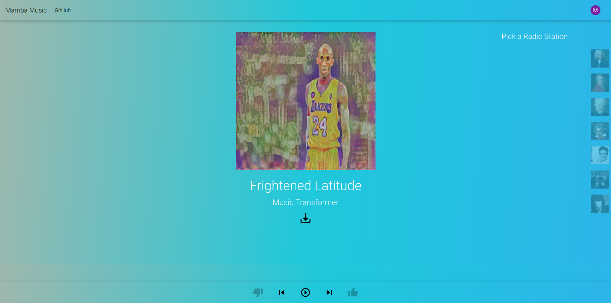

# Mamba Music
A cloud based machine learning platform for music generation, powered by Tensorflow's state of the art Magenta models.

Our Platform:


Members:
- [Aren Dalloul](https://github.com/adalloul0928)
- [Ayush Khanal](https://github.com/jptboy)
- [Brian Nguyen](https://github.com/BrianNguyen214)
- [Jeff Lucca](https://github.com/lucca)
- [Mackenzie Lobato](https://github.com/mackenzielobato)
- [Matthew Strong](https://github.com/peasant98)

## Navigation

### Frontend:

```sh
cd mamba-frontend
npm install
npm start
```

### Backend

```sh
cd mamba-api
```

### ML Models

```sh
cd mamba-magenta/mamba-magenta
pip3 -r install requirements.txt

# usage

python3 mamba_magenta_api.py -a <artists> -g <genre> -t <temperature> -l <length> -n <numgenerations>

```

### NEW: Neural Transfer


```sh
cd mamba-magenta/mamba-magenta/neural_style
./generate_art.sh

```
This command will generate pictures and put them in `mamba-magenta/mamba-magenta/neural_style/generated`.
Make sure to have pictures in `mamba-magenta/mamba-magenta/neural_style/generated` and `mamba-magenta/mamba-magenta/neural_style/content`.
